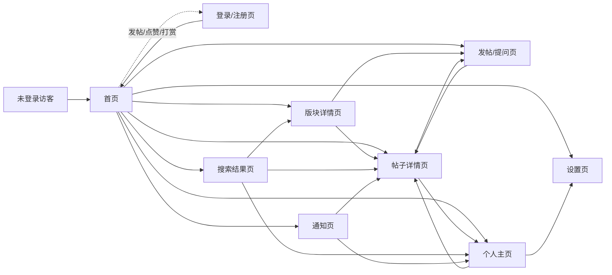

# AI辅助开发者论坛 · 信息架构文档

> 基于《AI辅助开发者论坛需求总结文档》推导，梳理页面清单、跳转关系与核心模块。

---

## 一、页面清单

| # | 页面 | 用途 |
|---|------|------|
| 1 | 首页 | 个性化推荐 Feed 与全站内容入口 |
| 2 | 版块详情页 | 单个版块下的帖子列表与入门/深度分区 |
| 3 | 帖子详情页 | 帖子正文、AI 问答区与社区补充区 |
| 4 | 发帖 / 提问页 | 创建帖子或提问，内嵌 AI 辅助写作 |
| 5 | 个人主页 | 用户资料、声望徽章与内容历史 |
| 6 | 登录 / 注册页 | 账号注册、登录与第三方授权 |
| 7 | 通知页 | 回复、点赞、采纳、打赏等互动消息 |
| 8 | 搜索结果页 | 全站帖子、用户、版块检索 |
| 9 | 设置页 | 账号信息、通知偏好与隐私设置 |

---

## 二、页面跳转关系

### 跳转说明

- **未登录浏览**：未登录访客可直接进入首页浏览；点击 Feed 中的帖子可进入帖子详情页查看（浏览连贯性需要）。仅发帖、点赞、打赏、关注等需要身份的操作才跳转登录页
- **登录/注册 → 首页**：登录后回首页或原触发页面
- **首页 → 各页面**：首页是中枢，通过顶部导航与 Feed 卡片分发到版块、帖子、发帖、个人中心
- **版块详情 → 帖子详情 / 发帖**：版块内点击帖子进详情，点发帖带版块预填进入发帖页
- **帖子详情 → 发帖 / 个人主页**：帖子内可跳转同版块发帖，点击作者头像进个人主页
- **发帖/提问 → 帖子详情**：发布成功后跳转到新帖详情页
- **搜索结果 → 帖子/版块/用户**：搜索结果可指向帖子详情、版块页或个人主页
- **通知 → 帖子/个人主页**：点击通知项跳转到对应帖子或用户主页
- **个人主页 → 设置**：个人主页内进入账号设置

---

## 三、页面核心模块

### 1. 首页
- 推荐 Feed
- 版块导航
- AI 问答快捷入口
- 热门 / 最新切换

### 2. 版块详情页
- 版块信息（名称、简介、关注按钮）
- 入门区 / 深度区切换
- 帖子列表
- 排序筛选
- 发帖入口

### 3. 帖子详情页
- 帖子正文
- AI 问答区（AI 答案 + 来源标注）
- 社区补充区（回复 / 纠错）
- 互动栏（点赞 / 踩 / 收藏 / 分享 / 打赏）
- 作者信息卡

### 4. 发帖 / 提问页
- 标题与版块选择
- 富文本编辑器
- AI 辅助写作工具栏（润色 / 代码格式 / 摘要 / 标签）
- 发布控制

### 5. 个人主页
- 用户资料（头像、技术栈标签）
- 声望与积分展示
- 徽章与等级
- 发帖 / 回答历史
- 打赏记录

### 6. 登录 / 注册页
- 登录表单
- 注册表单
- 第三方登录入口

### 7. 通知页
- 互动通知（回复 / 点赞 / 采纳）
- 打赏通知
- 声望变动
- 系统消息

### 8. 搜索结果页
- 搜索框
- 结果列表（帖子 / 用户 / 版块）
- 分类筛选

### 9. 设置页
- 账号信息
- 通知偏好
- 隐私设置
